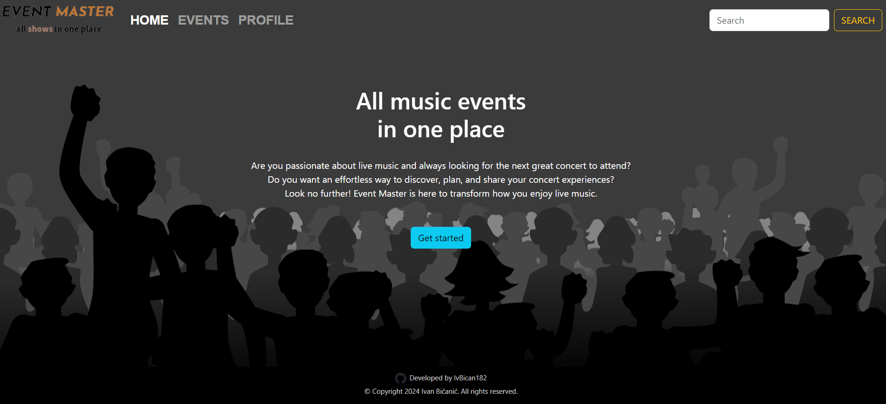
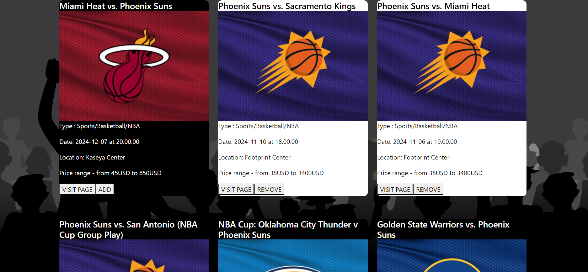

# Events-web-app
Web app that shows popular events, it uses TicketMaster API for fetching events. You can select events you want to attend, they will show
up in your profile page. 

* showcase images

## Requirements

* Node v16.7.0
* npm v7.20.3

## How to install

* This project uses Vite for bundling, frontend is written in React. Other dependencies will be installed as well.

1. clone this project
2. cd into "Events-web-app folder and run `npm install`. This will install npm and all the frontend dependencies.
3. Run - `npm run dev` to run the developer server, this will open the app in the browser.

